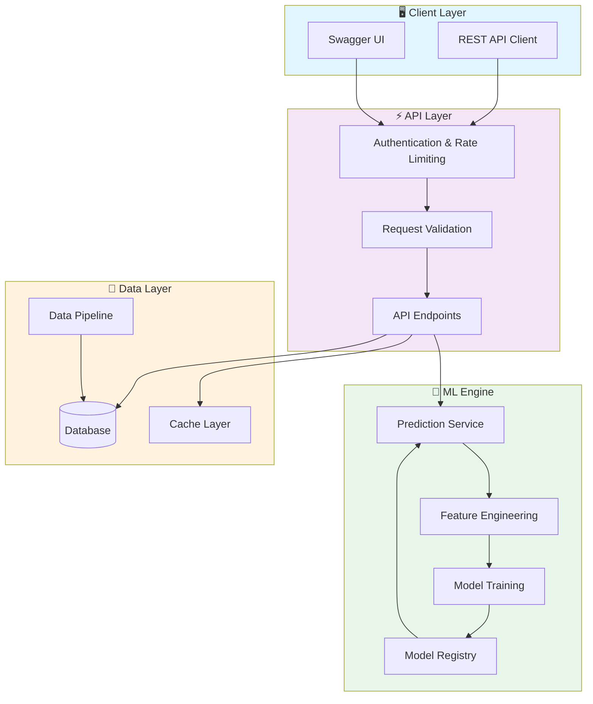
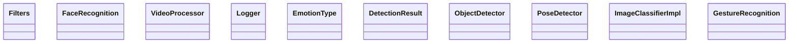

# 🤖 Ai Computer Vision Platform

> Professional repository showcasing advanced development skills

[](https://img.shields.io/badge/)
[](https://img.shields.io/badge/)
[](https://img.shields.io/badge/)
[](https://img.shields.io/badge/)
[](https://img.shields.io/badge/)
[](https://img.shields.io/badge/)
[](https://img.shields.io/badge/)
[](https://img.shields.io/badge/)
[](LICENSE)

[English](#english) | [Português](#português)

---

## English

### 🎯 Overview

**Ai Computer Vision Platform** is a production-grade Python application complemented by CSS, HTML, JavaScript that showcases modern software engineering practices including clean architecture, comprehensive testing, containerized deployment, and CI/CD readiness.

The codebase comprises **4,407 lines** of source code organized across **43 modules**, following industry best practices for maintainability, scalability, and code quality.

### ✨ Key Features

- **🤖 ML Pipeline**: End-to-end machine learning workflow from data to deployment
- **🔬 Feature Engineering**: Automated feature extraction and transformation
- **📊 Model Evaluation**: Comprehensive metrics and cross-validation
- **🚀 Model Serving**: Production-ready prediction API
- **🐳 Containerized**: Docker support for consistent deployment
- **🏗️ Object-Oriented**: 29 core classes with clean architecture

### 🏗️ Architecture





### 🚀 Quick Start

#### Prerequisites

- Python 3.12+
- pip (Python package manager)

#### Installation

```bash
# Clone the repository
git clone https://github.com/galafis/AI-Computer-Vision-Platform.git
cd AI-Computer-Vision-Platform

# Create and activate virtual environment
python -m venv venv
source venv/bin/activate  # On Windows: venv\Scripts\activate

# Install dependencies
pip install -r requirements.txt
```

#### Running

```bash
# Run the application
python main.py
```

### 🧪 Testing

```bash
# Run all tests
pytest

# Run with coverage report
pytest --cov --cov-report=html

# Run specific test module
pytest tests/test_main.py -v

# Run with detailed output
pytest -v --tb=short
```

### 📁 Project Structure

```
AI-Computer-Vision-Platform/
├── data/
├── docs/          # Documentation
│   └── assets/
├── models/        # Data models
├── notebooks/
├── src/          # Source code
│   ├── analysis/
│   │   ├── __init__.py
│   │   ├── emotion_analyzer.py
│   │   ├── emotion_analyzer_impl.py
│   │   ├── image_classifier.py
│   │   ├── image_classifier_impl.py
│   │   ├── scene_analyzer.py
│   │   └── scene_analyzer_impl.py
│   ├── detection/
│   │   ├── __init__.py
│   │   ├── face_detector.py
│   │   ├── object_detector.py
│   │   └── pose_detector.py
│   ├── processing/
│   │   ├── __init__.py
│   │   ├── filters.py
│   │   ├── image_processor.py
│   │   └── video_processor.py
│   ├── recognition/
│   │   ├── __init__.py
│   │   ├── face_recognition.py
│   │   ├── gesture_recognition.py
│   │   ├── gesture_recognizer_impl.py
│   │   └── text_recognition.py
│   ├── utils/         # Utilities
│   │   ├── __init__.py
│   │   ├── config.py
│   │   ├── helpers.py
│   │   └── logger.py
│   └── __init__.py
├── tests/         # Test suite
│   └── unit/
│       ├── test_emotion_analyzer.py
│       ├── test_face_recognition.py
│       ├── test_filters.py
│       ├── test_gesture_recognition.py
│       ├── test_gesture_recognizer.py
│       ├── test_helpers.py
│       ├── test_image_classifier.py
│       ├── test_image_processor.py
│       ├── test_object_detector.py
│       ├── test_scene_analyzer.py
│       ├── test_text_recognition.py
│       └── test_video_processor.py
├── Dockerfile
├── LICENSE
├── README.md
├── main.py
├── requirements.txt
├── script.js
└── setup.py
```

### 🛠️ Tech Stack

| Technology | Description | Role |
|------------|-------------|------|
| **Python** | Core Language | Primary |
| **Docker** | Containerization platform | Framework |
| **Gin** | Go web framework | Framework |
| **NumPy** | Numerical computing | Framework |
| **Pandas** | Data manipulation library | Framework |
| **PyTorch** | Deep learning framework | Framework |
| **scikit-learn** | Machine learning library | Framework |
| **TensorFlow** | Deep learning framework | Framework |
| HTML | 2 files | Supporting |
| JavaScript | 1 files | Supporting |
| CSS | 1 files | Supporting |

### 🤝 Contributing

Contributions are welcome! Please feel free to submit a Pull Request. For major changes, please open an issue first to discuss what you would like to change.

1. Fork the project
2. Create your feature branch (`git checkout -b feature/AmazingFeature`)
3. Commit your changes (`git commit -m 'Add some AmazingFeature'`)
4. Push to the branch (`git push origin feature/AmazingFeature`)
5. Open a Pull Request

### 📄 License

This project is licensed under the MIT License - see the [LICENSE](LICENSE) file for details.

### 👤 Author

**Gabriel Demetrios Lafis**
- GitHub: [@galafis](https://github.com/galafis)
- LinkedIn: [Gabriel Demetrios Lafis](https://linkedin.com/in/gabriel-demetrios-lafis)

---

## Português

### 🎯 Visão Geral

**Ai Computer Vision Platform** é uma aplicação Python de nível profissional, complementada por CSS, HTML, JavaScript que demonstra práticas modernas de engenharia de software, incluindo arquitetura limpa, testes abrangentes, implantação containerizada e prontidão para CI/CD.

A base de código compreende **4,407 linhas** de código-fonte organizadas em **43 módulos**, seguindo as melhores práticas do setor para manutenibilidade, escalabilidade e qualidade de código.

### ✨ Funcionalidades Principais

- **🤖 ML Pipeline**: End-to-end machine learning workflow from data to deployment
- **🔬 Feature Engineering**: Automated feature extraction and transformation
- **📊 Model Evaluation**: Comprehensive metrics and cross-validation
- **🚀 Model Serving**: Production-ready prediction API
- **🐳 Containerized**: Docker support for consistent deployment
- **🏗️ Object-Oriented**: 29 core classes with clean architecture

### 🏗️ Arquitetura


### 🚀 Início Rápido

#### Prerequisites

- Python 3.12+
- pip (Python package manager)

#### Installation

```bash
# Clone the repository
git clone https://github.com/galafis/AI-Computer-Vision-Platform.git
cd AI-Computer-Vision-Platform

# Create and activate virtual environment
python -m venv venv
source venv/bin/activate  # On Windows: venv\Scripts\activate

# Install dependencies
pip install -r requirements.txt
```

#### Running

```bash
# Run the application
python main.py
```

### 🧪 Testing

```bash
# Run all tests
pytest

# Run with coverage report
pytest --cov --cov-report=html

# Run specific test module
pytest tests/test_main.py -v

# Run with detailed output
pytest -v --tb=short
```

### 📁 Estrutura do Projeto

```
AI-Computer-Vision-Platform/
├── data/
├── docs/          # Documentation
│   └── assets/
├── models/        # Data models
├── notebooks/
├── src/          # Source code
│   ├── analysis/
│   │   ├── __init__.py
│   │   ├── emotion_analyzer.py
│   │   ├── emotion_analyzer_impl.py
│   │   ├── image_classifier.py
│   │   ├── image_classifier_impl.py
│   │   ├── scene_analyzer.py
│   │   └── scene_analyzer_impl.py
│   ├── detection/
│   │   ├── __init__.py
│   │   ├── face_detector.py
│   │   ├── object_detector.py
│   │   └── pose_detector.py
│   ├── processing/
│   │   ├── __init__.py
│   │   ├── filters.py
│   │   ├── image_processor.py
│   │   └── video_processor.py
│   ├── recognition/
│   │   ├── __init__.py
│   │   ├── face_recognition.py
│   │   ├── gesture_recognition.py
│   │   ├── gesture_recognizer_impl.py
│   │   └── text_recognition.py
│   ├── utils/         # Utilities
│   │   ├── __init__.py
│   │   ├── config.py
│   │   ├── helpers.py
│   │   └── logger.py
│   └── __init__.py
├── tests/         # Test suite
│   └── unit/
│       ├── test_emotion_analyzer.py
│       ├── test_face_recognition.py
│       ├── test_filters.py
│       ├── test_gesture_recognition.py
│       ├── test_gesture_recognizer.py
│       ├── test_helpers.py
│       ├── test_image_classifier.py
│       ├── test_image_processor.py
│       ├── test_object_detector.py
│       ├── test_scene_analyzer.py
│       ├── test_text_recognition.py
│       └── test_video_processor.py
├── Dockerfile
├── LICENSE
├── README.md
├── main.py
├── requirements.txt
├── script.js
└── setup.py
```

### 🛠️ Stack Tecnológica

| Tecnologia | Descrição | Papel |
|------------|-----------|-------|
| **Python** | Core Language | Primary |
| **Docker** | Containerization platform | Framework |
| **Gin** | Go web framework | Framework |
| **NumPy** | Numerical computing | Framework |
| **Pandas** | Data manipulation library | Framework |
| **PyTorch** | Deep learning framework | Framework |
| **scikit-learn** | Machine learning library | Framework |
| **TensorFlow** | Deep learning framework | Framework |
| HTML | 2 files | Supporting |
| JavaScript | 1 files | Supporting |
| CSS | 1 files | Supporting |

### 🤝 Contribuindo

Contribuições são bem-vindas! Sinta-se à vontade para enviar um Pull Request.

### 📄 Licença

Este projeto está licenciado sob a Licença MIT - veja o arquivo [LICENSE](LICENSE) para detalhes.

### 👤 Autor

**Gabriel Demetrios Lafis**
- GitHub: [@galafis](https://github.com/galafis)
- LinkedIn: [Gabriel Demetrios Lafis](https://linkedin.com/in/gabriel-demetrios-lafis)
