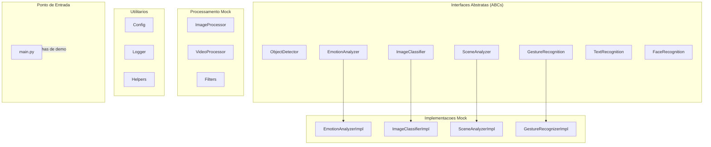
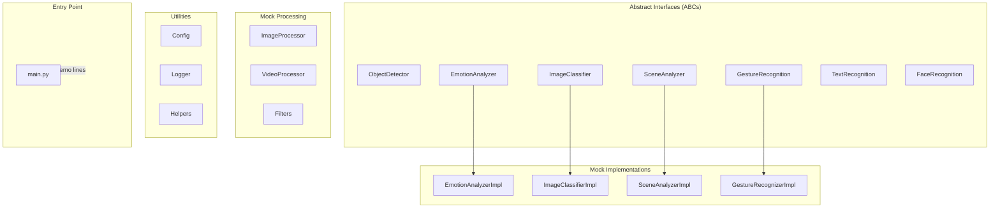

# AI-Computer-Vision-Platform

[](https://www.python.org/)
[](https://opencv.org/)
[](https://numpy.org/)
[](LICENSE)

[Portugues](#portugues) | [English](#english)

---

## Portugues

### Visao Geral

Plataforma de visao computacional com arquitetura modular em Python usando OpenCV e NumPy. Inclui classes abstratas (ABCs) e implementacoes mock para deteccao de objetos, analise de emocoes, classificacao de imagens, reconhecimento de gestos e processamento de imagem/video.

> **Aviso importante:** Este projeto contem classes base abstratas com docstrings e implementacoes mock que retornam valores fixos codificados. **Nenhuma inferencia real de visao computacional e realizada.** Trata-se de uma demonstracao de arquitetura e interfaces, nao de um sistema de visao computacional funcional.

### O que existe

- Interfaces abstratas (ABCs) para: ObjectDetector, EmotionAnalyzer, ImageClassifier, SceneAnalyzer, GestureRecognizer, TextRecognizer, FaceRecognizer
- Implementacoes mock que retornam valores fixos codificados (hardcoded)
- Classes de processamento: ImageProcessor, VideoProcessor, Filters (todas com metodos mock)
- Utilitarios: Config (carrega YAML/JSON), Logger (wrapper do logging), Helpers (manipulacao de arquivos e hashing)
- ~1050 linhas de testes scaffold que verificam os valores de retorno dos mocks

### O que NAO existe

- Modelos de machine learning reais
- Pesos treinados
- Inferencia real de imagens ou video
- API REST
- Banco de dados
- Autenticacao
- Processamento real de imagens (todos os metodos sao mock/simulados)

### Arquitetura



### Tecnologias

| Tecnologia | Uso real |
|---|---|
| **Python** | Linguagem principal |
| **OpenCV** | Importado, mas usado apenas para type hints e operacoes basicas |
| **NumPy** | Arrays e zeros para retornos mock |
| **PyYAML** | Carregamento de configuracao YAML |

### Inicio Rapido

```bash
# Clonar o repositorio
git clone https://github.com/galafis/AI-Computer-Vision-Platform.git
cd AI-Computer-Vision-Platform

# Criar e ativar ambiente virtual
python -m venv venv
source venv/bin/activate  # Windows: venv\Scripts\activate

# Instalar dependencias
pip install -r requirements.txt

# Executar (imprime 2 linhas de saida demo)
python main.py
```

### Testes

```bash
# Executar todos os testes
pytest

# Com relatorio de cobertura
pytest --cov --cov-report=html
```

Os testes (~1050 linhas) verificam que as implementacoes mock retornam os valores fixos esperados.

### Estrutura do Projeto

```
AI-Computer-Vision-Platform/
├── src/
│   ├── analysis/           # ABCs + mocks para analise
│   │   ├── emotion_analyzer.py
│   │   ├── emotion_analyzer_impl.py
│   │   ├── image_classifier.py
│   │   ├── image_classifier_impl.py
│   │   ├── scene_analyzer.py
│   │   └── scene_analyzer_impl.py
│   ├── detection/          # ABC para deteccao de objetos
│   │   └── object_detector.py
│   ├── processing/         # Classes mock de processamento
│   │   ├── filters.py
│   │   ├── image_processor.py
│   │   └── video_processor.py
│   ├── recognition/        # ABCs + mocks para reconhecimento
│   │   ├── face_recognition.py
│   │   ├── gesture_recognition.py
│   │   ├── gesture_recognizer_impl.py
│   │   └── text_recognition.py
│   └── utils/              # Utilitarios
│       ├── config.py
│       ├── helpers.py
│       └── logger.py
├── tests/unit/             # Testes scaffold
├── main.py                 # Ponto de entrada (2 linhas de saida)
├── requirements.txt
└── LICENSE
```

### Licenca

Este projeto esta licenciado sob a Licenca MIT - veja o arquivo [LICENSE](LICENSE) para detalhes.

### Autor

**Gabriel Demetrios Lafis**
- GitHub: [@galafis](https://github.com/galafis)
- LinkedIn: [Gabriel Demetrios Lafis](https://linkedin.com/in/gabriel-demetrios-lafis)

---

## English

### Overview

A modular computer vision platform in Python using OpenCV and NumPy. Includes abstract base classes (ABCs) and mock implementations for object detection, emotion analysis, image classification, gesture recognition, and image/video processing.

> **Important notice:** This project contains abstract base classes with docstrings and mock implementations that return hardcoded values. **No actual computer vision inference is performed.** This is an architecture/interface demonstration, not a working CV system.

### What exists

- Abstract interfaces (ABCs) for: ObjectDetector, EmotionAnalyzer, ImageClassifier, SceneAnalyzer, GestureRecognizer, TextRecognizer, FaceRecognizer
- Mock implementations returning hardcoded values
- Processing classes: ImageProcessor, VideoProcessor, Filters (all with mock methods)
- Utilities: Config (loads YAML/JSON), Logger (logging wrapper), Helpers (file handling and hashing)
- ~1050 lines of scaffold tests that verify mock return values

### What does NOT exist

- Real ML models
- Trained weights
- Actual image or video inference
- REST API
- Database
- Authentication
- Real image processing (all methods are mock/simulated)

### Architecture



### Tech Stack

| Technology | Actual usage |
|---|---|
| **Python** | Core language |
| **OpenCV** | Imported but used only for type hints and basic ops |
| **NumPy** | Arrays and zeros for mock returns |
| **PyYAML** | YAML config loading |

### Quick Start

```bash
# Clone the repository
git clone https://github.com/galafis/AI-Computer-Vision-Platform.git
cd AI-Computer-Vision-Platform

# Create and activate virtual environment
python -m venv venv
source venv/bin/activate  # Windows: venv\Scripts\activate

# Install dependencies
pip install -r requirements.txt

# Run (prints 2 lines of demo output)
python main.py
```

### Tests

```bash
# Run all tests
pytest

# With coverage report
pytest --cov --cov-report=html
```

Tests (~1050 lines) verify that mock implementations return the expected hardcoded values.

### Project Structure

```
AI-Computer-Vision-Platform/
├── src/
│   ├── analysis/           # ABCs + mocks for analysis
│   │   ├── emotion_analyzer.py
│   │   ├── emotion_analyzer_impl.py
│   │   ├── image_classifier.py
│   │   ├── image_classifier_impl.py
│   │   ├── scene_analyzer.py
│   │   └── scene_analyzer_impl.py
│   ├── detection/          # ABC for object detection
│   │   └── object_detector.py
│   ├── processing/         # Mock processing classes
│   │   ├── filters.py
│   │   ├── image_processor.py
│   │   └── video_processor.py
│   ├── recognition/        # ABCs + mocks for recognition
│   │   ├── face_recognition.py
│   │   ├── gesture_recognition.py
│   │   ├── gesture_recognizer_impl.py
│   │   └── text_recognition.py
│   └── utils/              # Utilities
│       ├── config.py
│       ├── helpers.py
│       └── logger.py
├── tests/unit/             # Scaffold tests
├── main.py                 # Entry point (2 lines of output)
├── requirements.txt
└── LICENSE
```

### License

This project is licensed under the MIT License - see the [LICENSE](LICENSE) file for details.

### Author

**Gabriel Demetrios Lafis**
- GitHub: [@galafis](https://github.com/galafis)
- LinkedIn: [Gabriel Demetrios Lafis](https://linkedin.com/in/gabriel-demetrios-lafis)
