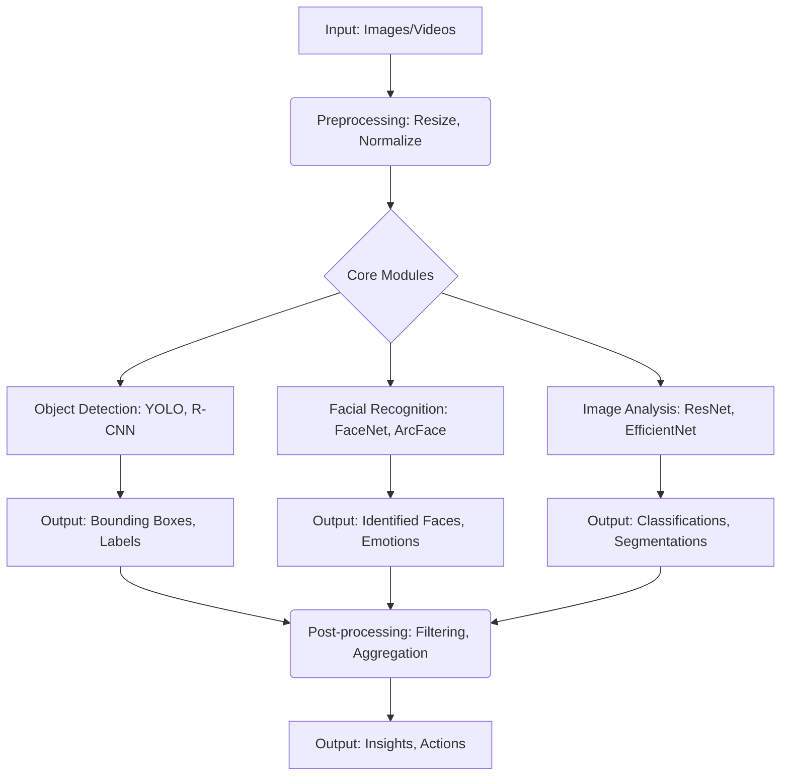
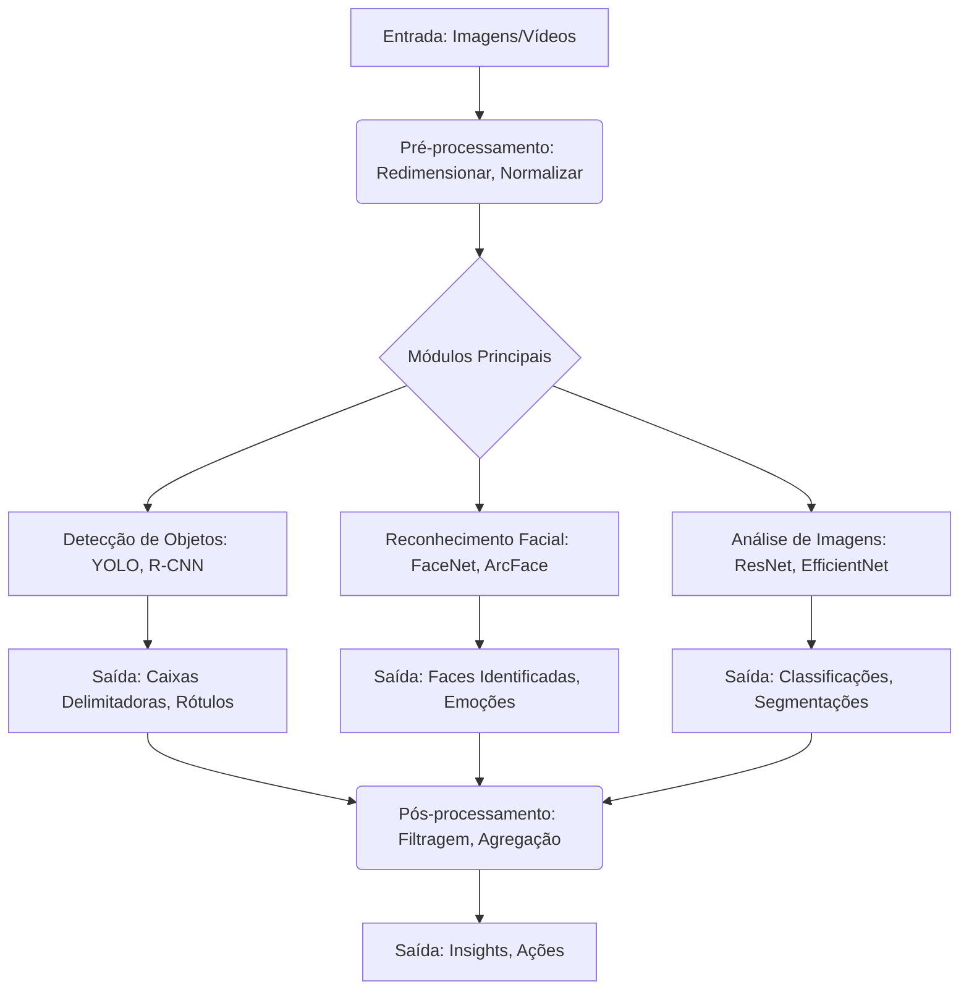

# AI Computer Vision Platform


## English

### Overview

This is an advanced AI Computer Vision Platform designed for image processing, object detection, facial recognition, and real-time visual analysis. It integrates multiple image processing and deep learning techniques for automated and intelligent visual analysis.

### Architecture Diagram



### Features

- **Object Detection**: YOLO, R-CNN, SSD for real-time identification.
- **Facial Recognition**: Face detection, recognition, and emotion analysis.
- **Image Analysis**: Classification, segmentation, and feature extraction.
- **Real-Time Processing**: Optimized pipeline for low latency.
- **Deep Learning**: Custom CNNs and transfer learning.
- **Video Processing**: Frame-by-frame analysis and tracking.

### Technologies

- **Python 3.8+**: Main programming language.
- **OpenCV**: Image and video processing.
- **TensorFlow/Keras**: Deep learning and neural networks.
- **PyTorch**: Advanced computer vision models.
- **YOLO**: Real-time object detection.
- **MediaPipe**: ML solutions for visual analysis.
- **NumPy**: Optimized numerical operations.
- **Pandas**: Dataset manipulation.
- **Pillow**: Image processing.
- **Scikit-image**: Processing algorithms.
- **Matplotlib/Seaborn**: Result visualization.

### Project Structure

```
AI-Computer-Vision-Platform/
├── src/
│   ├── detection/              # Detection modules
│   ├── recognition/            # Recognition modules
│   ├── analysis/               # Analysis and classification
│   ├── processing/             # Image processing
│   └── utils/                  # Utilities
├── models/                     # Trained models
├── data/                       # Datasets and samples
├── notebooks/                  # Jupyter notebooks
├── tests/                      # Automated tests
├── docs/                       # Documentation files
├── config/                     # Configuration files
├── main.py                     # Main application
├── requirements.txt            # Dependencies
└── README.md                   # Project documentation
```

### Quick Start

#### Prerequisites

- Python 3.8+
- OpenCV 4.5+
- CUDA (optional, for GPU acceleration)

#### Installation

1.  **Clone the repository:**

    ```bash
    git clone https://github.com/galafis/AI-Computer-Vision-Platform.git
    cd AI-Computer-Vision-Platform
    ```

2.  **Set up the environment:**

    ```bash
    python -m venv venv
    source venv/bin/activate  # Linux/Mac
    # or venv\Scripts\activate  # Windows

    pip install -r requirements.txt
    ```

3.  **Run the application:**

    ```bash
    python main.py
    ```

### Usage Examples

#### Object Detection

```python
from src.detection.object_detector import ObjectDetector

detector = ObjectDetector(model=\'yolov5\')
results = detector.detect(image_path=\'sample.jpg\')

for obj in results:
    print(f"Object: {obj.class_name}, Confidence: {obj.confidence:.2f}")
```

#### Facial Recognition

```python
from src.recognition.face_recognition import FaceRecognizer

recognizer = FaceRecognizer()
recognizer.load_known_faces(\'data/faces/\')

# Recognize faces in image
faces = recognizer.recognize(image_path=\'group_photo.jpg\')
for face in faces:
    print(f"Identified Person: {face.name}")
```

#### Emotion Analysis

```python
from src.analysis.emotion_analyzer import EmotionAnalyzer

analyzer = EmotionAnalyzer()
emotions = analyzer.analyze(image_path=\'portrait.jpg\')

print(f"Predominant Emotion: {emotions.primary_emotion}")
print(f"Confidence: {emotions.confidence:.2f}")
```

#### Video Processing

```python
from src.processing.video_processor import VideoProcessor

processor = VideoProcessor()
processor.process_video(
    input_path=\'input_video.mp4\',
    output_path=\'processed_video.mp4\',
    operations=[\'face_detection\', \'object_tracking\']
)
```

### Implemented Models

#### Object Detection

- **YOLOv5/YOLOv8**: Real-time object detection
- **Faster R-CNN**: High accuracy object detection
- **SSD MobileNet**: Lightweight detection for mobile

#### Face Recognition

- **FaceNet**: Face embedding and recognition
- **ArcFace**: State-of-the-art face recognition
- **MTCNN**: Multi-task face detection

#### Image Classification

- **ResNet**: Deep residual networks
- **EfficientNet**: Efficient convolutional networks
- **Vision Transformer**: Transformer-based classification

### Performance and Optimization

#### Benchmarks

- **Object Detection**: 30-60 FPS (GPU), 5-15 FPS (CPU)
- **Facial Recognition**: <100ms per face
- **Image Classification**: <50ms per image
- **Video Processing**: Real-time up to 1080p

#### Implemented Optimizations

- **TensorRT**: GPU acceleration for TensorFlow models
- **ONNX**: Cross-platform optimization
- **Quantization**: Precision reduction for higher speed
- **Batch Processing**: Batch processing for efficiency

### Advanced Configuration

#### Model Configuration

```python
# config/models.py
MODEL_CONFIG = {
    \'object_detection\': {
        \'model\': \'yolov8n\',
        \'confidence_threshold\': 0.5,
        \'iou_threshold\': 0.4
    },
    \'face_recognition\': {
        \'model\': \'facenet\',
        \'distance_threshold\': 0.6,
        \'min_face_size\': 20
    }
}
```

#### Hardware Configuration

```python
# GPU Configuration
import tensorflow as tf

gpus = tf.config.experimental.list_physical_devices(\'GPU\')
if gpus:
    tf.config.experimental.set_memory_growth(gpus[0], True)
```

### Testing and Validation

#### Run Tests

```bash
# Unit tests
pytest tests/unit/

# Performance tests
pytest tests/performance/

# Integration tests
pytest tests/integration/
```

#### Evaluation Metrics

- **mAP (mean Average Precision)**: For object detection
- **Accuracy**: For classification
- **Precision/Recall**: For recognition systems
- **FPS**: For real-time performance

### Practical Applications

#### Security and Surveillance

- Intruder detection
- License plate recognition
- Behavioral analysis
- Access control

#### Health and Medicine

- Medical image analysis
- Anomaly detection
- Patient monitoring
- Assisted diagnosis

#### Retail and E-commerce

- Customer behavior analysis
- Product recognition
- Visual inventory control
- Personalized shopping experience

## Português

### Visão Geral

Esta é uma Plataforma avançada de Computer Vision com IA, projetada para processamento de imagens, detecção de objetos, reconhecimento facial e análise visual em tempo real. Ela integra múltiplas técnicas de processamento de imagem e deep learning para análise visual automatizada e inteligente.

### Diagrama de Arquitetura



### Características

- **Detecção de Objetos**: YOLO, R-CNN, SSD para identificação em tempo real.
- **Reconhecimento Facial**: Detecção facial, reconhecimento e análise de emoções.
- **Análise de Imagens**: Classificação, segmentação e extração de características.
- **Processamento em Tempo Real**: Pipeline otimizado para baixa latência.
- **Deep Learning**: CNNs customizadas e transfer learning.
- **Processamento de Vídeo**: Análise quadro a quadro e rastreamento.

### Tecnologias

- **Python 3.8+**: Linguagem de programação principal.
- **OpenCV**: Processamento de imagens e vídeo.
- **TensorFlow/Keras**: Deep learning e redes neurais.
- **PyTorch**: Modelos avançados de computer vision.
- **YOLO**: Detecção de objetos em tempo real.
- **MediaPipe**: Soluções de ML para análise visual.
- **NumPy**: Operações numéricas otimizadas.
- **Pandas**: Manipulação de conjuntos de dados.
- **Pillow**: Processamento de imagens.
- **Scikit-image**: Algoritmos de processamento.
- **Matplotlib/Seaborn**: Visualização de resultados.

### Estrutura do Projeto

```
AI-Computer-Vision-Platform/
├── src/
│   ├── detection/              # Módulos de detecção
│   ├── recognition/            # Módulos de reconhecimento
│   ├── analysis/               # Análise e classificação
│   ├── processing/             # Processamento de imagens
│   └── utils/                  # Utilitários
├── models/                     # Modelos treinados
├── data/                       # Conjuntos de dados e amostras
├── notebooks/                  # Jupyter notebooks
├── tests/                      # Testes automatizados
├── docs/                       # Arquivos de documentação
├── config/                     # Arquivos de configuração
├── main.py                     # Aplicação principal
├── requirements.txt            # Dependências
└── README.md                   # Documentação do projeto
```

### Início Rápido

#### Pré-requisitos

- Python 3.8+
- OpenCV 4.5+
- CUDA (opcional, para aceleração GPU)

#### Instalação

1.  **Clone o repositório:**

    ```bash
    git clone https://github.com/galafis/AI-Computer-Vision-Platform.git
    cd AI-Computer-Vision-Platform
    ```

2.  **Configure o ambiente:**

    ```bash
    python -m venv venv
    source venv/bin/activate  # Linux/Mac
    # ou venv\Scripts\activate  # Windows

    pip install -r requirements.txt
    ```

3.  **Execute a aplicação:**

    ```bash
    python main.py
    ```

### Exemplos de Uso

#### Detecção de Objetos

```python
from src.detection.object_detector import ObjectDetector

detector = ObjectDetector(model=\'yolov5\')
results = detector.detect(image_path=\'sample.jpg\')

for obj in results:
    print(f"Objeto: {obj.class_name}, Confiança: {obj.confidence:.2f}")
```

#### Reconhecimento Facial

```python
from src.recognition.face_recognition import FaceRecognizer

recognizer = FaceRecognizer()
recognizer.load_known_faces(\'data/faces/\')

# Reconhecer faces em imagem
faces = recognizer.recognize(image_path=\'group_photo.jpg\')
for face in faces:
    print(f"Pessoa identificada: {face.name}")
```

#### Análise de Emoções

```python
from src.analysis.emotion_analyzer import EmotionAnalyzer

analyzer = EmotionAnalyzer()
emotions = analyzer.analyze(image_path=\'portrait.jpg\')

print(f"Emoção predominante: {emotions.primary_emotion}")
print(f"Confiança: {emotions.confidence:.2f}")
```

#### Processamento de Vídeo

```python
from src.processing.video_processor import VideoProcessor

processor = VideoProcessor()
processor.process_video(
    input_path=\'input_video.mp4\',
    output_path=\'processed_video.mp4\',
    operations=[\'face_detection\', \'object_tracking\']
)
```

### Modelos Implementados

#### Detecção de Objetos

- **YOLOv5/YOLOv8**: Detecção de objetos em tempo real
- **Faster R-CNN**: Detecção de objetos de alta precisão
- **SSD MobileNet**: Detecção leve para dispositivos móveis

#### Reconhecimento Facial

- **FaceNet**: Incorporação e reconhecimento facial
- **ArcFace**: Reconhecimento facial de última geração
- **MTCNN**: Detecção facial multi-tarefa

#### Classificação de Imagens

- **ResNet**: Redes residuais profundas
- **EfficientNet**: Redes convolucionais eficientes
- **Vision Transformer**: Classificação baseada em Transformer

### Performance e Otimização

#### Benchmarks

- **Detecção de Objetos**: 30-60 FPS (GPU), 5-15 FPS (CPU)
- **Reconhecimento Facial**: <100ms por face
- **Classificação de Imagens**: <50ms por imagem
- **Processamento de Vídeo**: Tempo real até 1080p

#### Otimizações Implementadas

- **TensorRT**: Aceleração GPU para modelos TensorFlow
- **ONNX**: Otimização cross-platform
- **Quantização**: Redução de precisão para maior velocidade
- **Processamento em Lotes**: Processamento em lotes para eficiência

### Configuração Avançada

#### Configuração de Modelos

```python
# config/models.py
MODEL_CONFIG = {
    \'object_detection\': {
        \'model\': \'yolov8n\',
        \'confidence_threshold\': 0.5,
        \'iou_threshold\': 0.4
    },
    \'face_recognition\': {
        \'model\': \'facenet\',
        \'distance_threshold\': 0.6,
        \'min_face_size\': 20
    }
}
```

#### Configuração de Hardware

```python
# Configuração para GPU
import tensorflow as tf

gpus = tf.config.experimental.list_physical_devices(\'GPU\')
if gpus:
    tf.config.experimental.set_memory_growth(gpus[0], True)
```

### Testes e Validação

#### Executar Testes

```bash
# Testes unitários
pytest tests/unit/

# Testes de performance
pytest tests/performance/

# Testes de integração
pytest tests/integration/
```

#### Métricas de Avaliação

- **mAP (mean Average Precision)**: Para detecção de objetos
- **Acurácia**: Para classificação
- **Precisão/Recall**: Para sistemas de reconhecimento
- **FPS**: Para performance em tempo real

### Aplicações Práticas

#### Segurança e Vigilância

- Detecção de intrusos
- Reconhecimento de placas
- Análise comportamental
- Controle de acesso

#### Saúde e Medicina

- Análise de imagens médicas
- Detecção de anomalias
- Monitoramento de pacientes
- Diagnóstico assistido

#### Varejo e E-commerce

- Análise de comportamento do cliente
- Reconhecimento de produtos
- Controle de estoque visual
- Experiência de compra personalizada

## License

This project is licensed under the MIT License - see the [LICENSE](LICENSE) file for details.

## Author

**Gabriel Demetrios Lafis**

- GitHub: [@galafis](https://github.com/galafis)
- Email: gabrieldemetrios@gmail.com

---

⭐ If this project was helpful, consider leaving a star!

